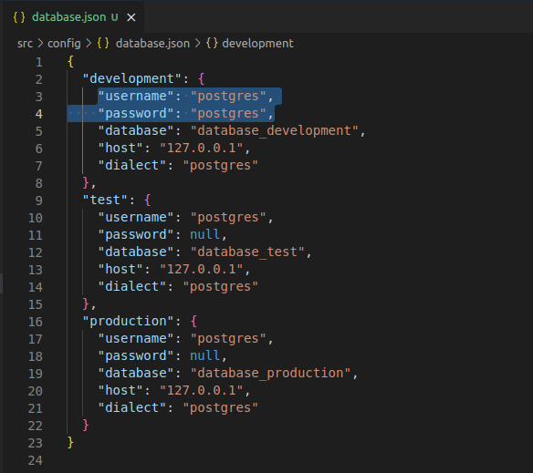
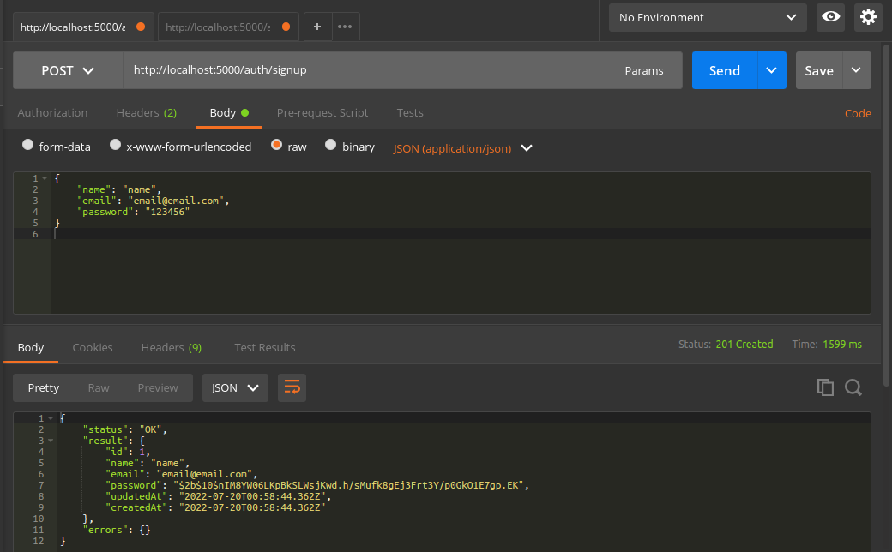
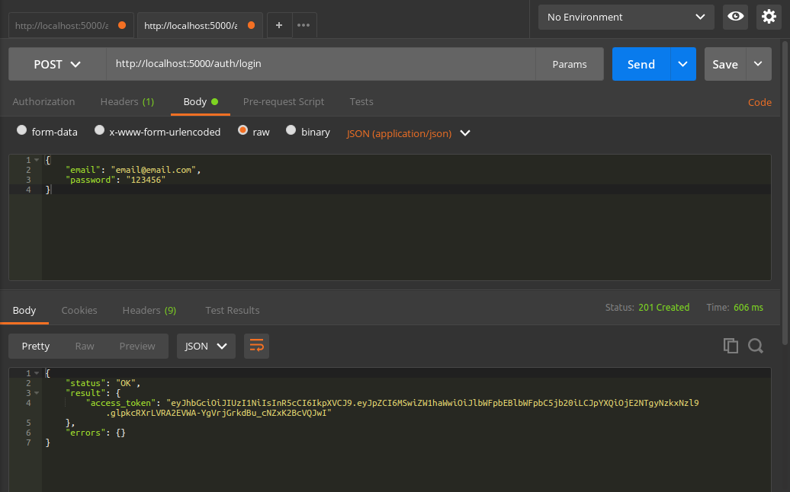
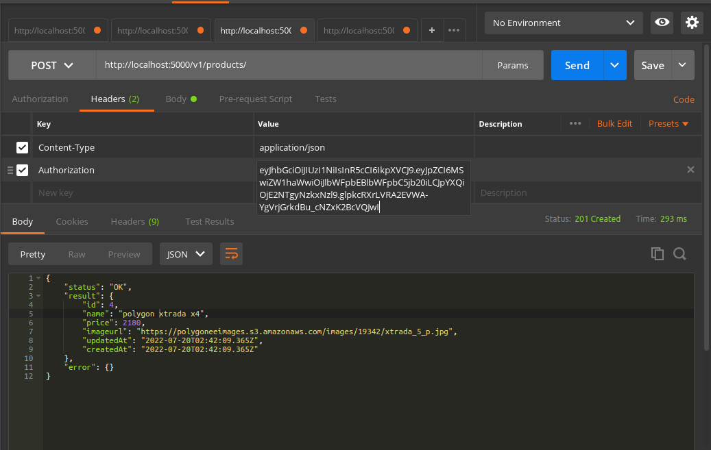

## Required applications are installed :
* Node Js https://nodejs.org/en/download/
* PostgreSQL https://www.postgresql.org/download/

### Bagaimana cara menjalankan App ini?

* Clone repository ini :
  ```bash
    git clone https://github.com/ciptowi/product-api.git
  ```
* Sesuaikan konfigurasi database dengan local anda, ubah file `database.json` pada directory `src/config/database.json`. Ganti username & password yang sesuai
  <div></div>
*  Install dependencies yang dibutuhkan dengan menjalankan perintah :
   ```bash
    npm install
    ```
* Buat database baru sesuai konfigurasi pada `database.json`, jalankan perintah :
  ```bash
  sequelize db:create
  ```
* Migrasi database sesuai dengan model yang telah dibuat, jalankan perintah :
  ```bash
  sequelize db:migrate
  ```
* Running server dengan menjalankan perintah :
  ```bash
  npm run dev
  ```
  
  ### Testing API
  * Registrasi Awal `http://localhost:5000/auth/signup` dengan method `POST`
    <div></div>
  * Login `http://localhost:5000/auth/login` dengan method `POST`
    <div></div>
  * Setting Header `Authorisazion` isi value dengan `acces_token` login
    <div></div>
    
  #### Dokumentasi API https://testbinar.docs.apiary.io/
